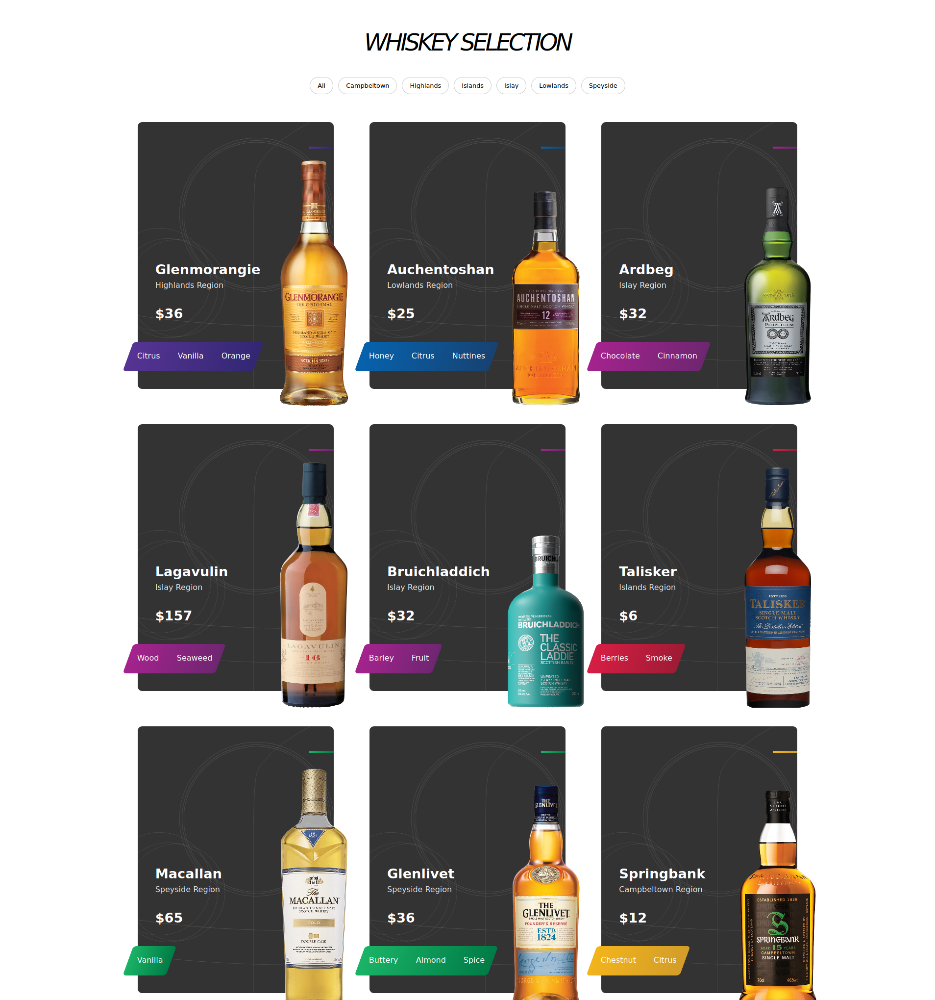
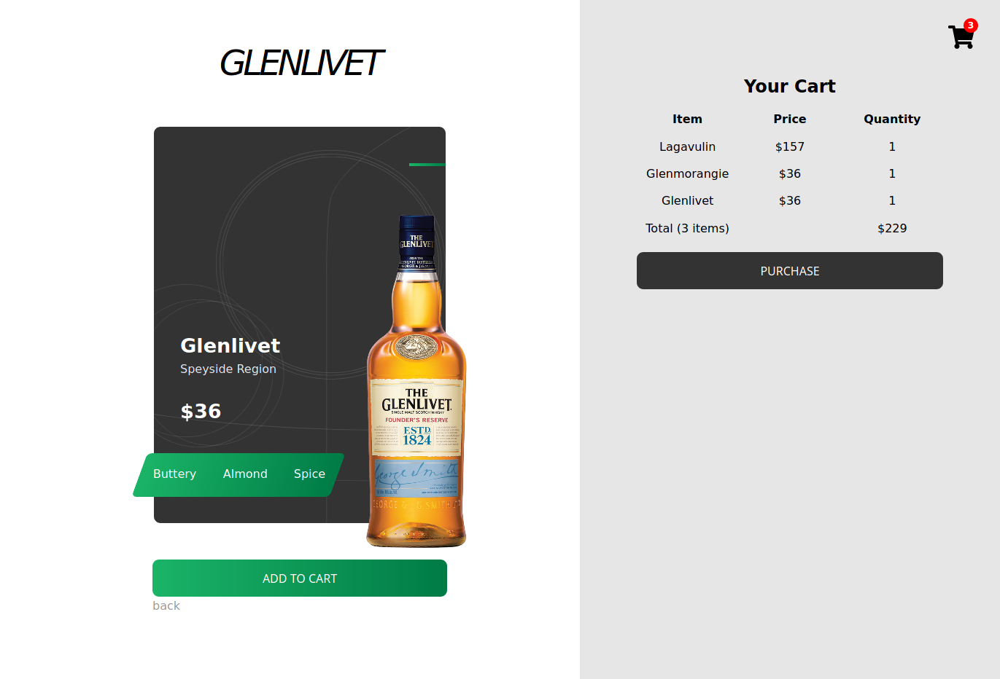

## Whiskies Webshop App

### [Check out the deployed version here!](https://react-webshop-app.netlify.app/)

### Installation

- `git clone git@github.com:Laphatradap/whiskies-webshop-app.git`
- `cd whiskies-webshop-app`
- `npm install`
- `npm run start`

### Technologies used

- [React Hooks](./src/components/ProductList/index.jsx)
- [Redux-Thunk](./src/store/products/actions.js)
- [Sass](./src/styles/_ProductList.scss)
- [Axios](./src/store/articles/actions.js)

### Features implemented

- A Homepage that contains a collection of popular whiskies, controls to filter these whiskies by their region, and an article that relates to this collection.
- Each region has a pair of colors associated with it.
- The article links — in a new tab — to the website where the article was originally published.
- Each item links to its own page, where it can be added to cart.

### Styling with Sass

- [Desktop-first approach](./src/styles/_Article.scss)

### Screenshots

### Git usage

- [git branches and commit messages](https://github.com/Laphatradap/whiskies-webshop-app/commits/master)

### Create React App

- This project was bootstrapped with [Create React App](https://github.com/facebook/create-react-app).

**Any feedback to improve my code or git usage: [please drop me a message](https://www.linkedin.com/in/laphatradaphusri/)!**
